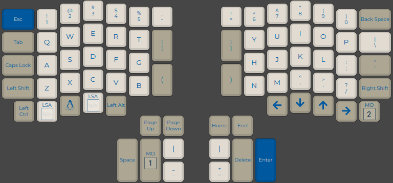

# Ergodox keyboard

My first keyboard is [Ergodox](https://ergodox.io) in its default 76 keys setup.

## Parts

This keyboard built from wide-accesseble and cheap parts:

- PCB. Ergodox PCB design is open source, and anyone can DIY or order production at the factory.
- 3D-printed case with minor improvements.
- Cherry Brown switches
- PBT keycaps

## Firmware

My Ergodox keyboard powered by QMK firmware.

[QMK Configurator](https://config.qmk.fm) file [here](https://github.com/exepirit/my-keyboard/blob/master/ergodox/qmk_layout.json).

## 3D printed case

Popular 3D printed Ergodox case published in official site. I slightly modify this design: use M3 inserts for better strength, and add anti-slip feets.

3D models of my own modified case published in [exepirit/my-ergodox-case](https://github.com/exepirit/my-ergodox-case) repository.